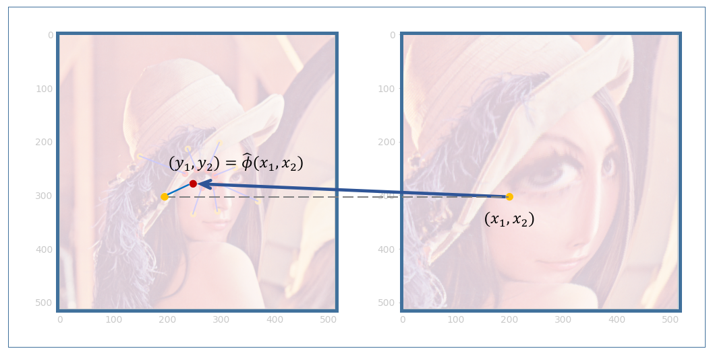
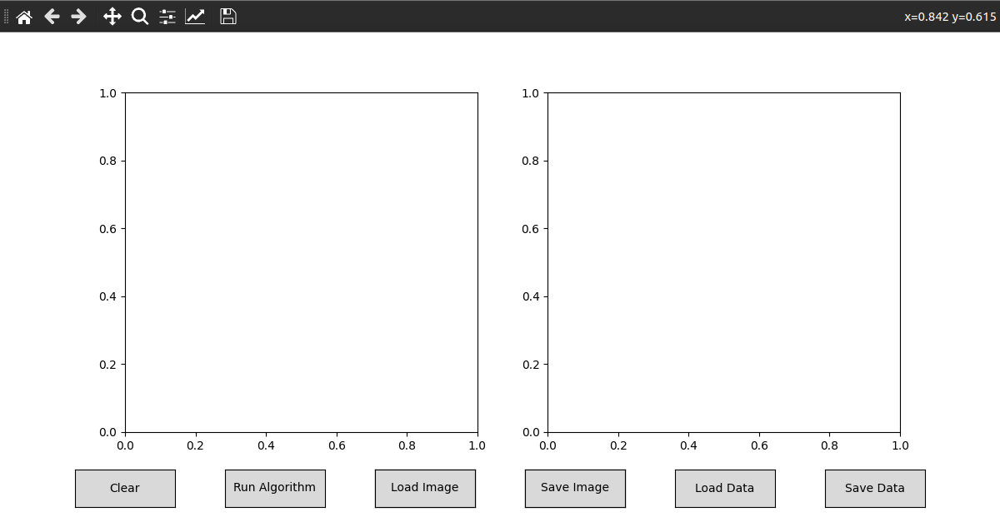
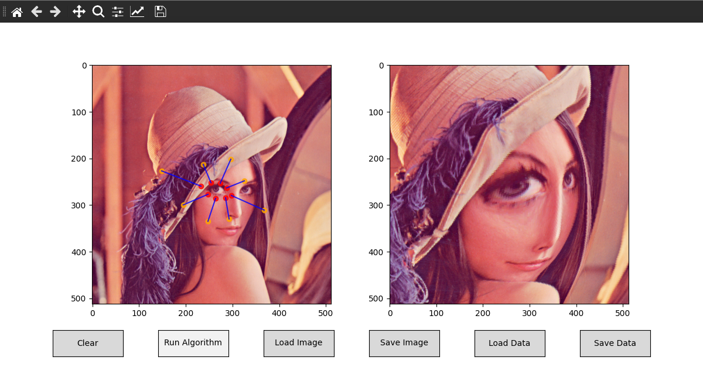

# HW2 Coding Exercise

## Exercise 6: High-Dimensional Linear Regression for Image Warping



A Python framework in provided in `./Exercise-6-framework.py`,
and the figure above is an example output of your job.
Your job is to fulfill the functions with `TODO`s:

```python
class Algorithm:
    def __init__(self, ...) -> None:
        ...
        """
        TODO
        """
        self.A: np.matrix = None
        self.b: np.matrix = None
        self.W: np.matrix = None

    def train(self, point_pairs) -> None:
        """
        TODO
        """
        raise NotImplementedError

    def predict(self, x, y) -> tuple:
        """
        TODO
        """
        raise NotImplementedError
```

Here, `point_pairs` has the form of

```python
point_pairs = [
    [[y_1, y_2], [x_1, x_2]],
    [[y_1, y_2], [x_1, x_2]],
    [[y_1, y_2], [x_1, x_2]],
    ...
]
```

and function `predict` is exactly the map $\hat{\phi}$. In the code template, `predict` is called automatically by application:

```python
x_src, y_src = algorithm.predict(x, y)
```

You may remove all the `try:`s and `except:`s to debug your code conveniently.
When finished, run

```shell
python framework.py
```

If successfully, you can see a window like

<center>

</center>

There will be two blank images at the top. The left side will display the source image, where you can drag control points. The right side will show the output of the algorithm. 

Below, there are several buttons. First, you need to load an image using the `Load Image` button, then place control points on the image (press and drag the left mouse button, release the button to stop). You can clear the control points by pressing the `Clear` button. Then, click `Run Algorithm` to execute the warping algorithm. The `Save Image` button allows you to save the current canvas. By clicking `Load Data`, you can load control point information from a JSON file, and the `Save Data` button allows you to save the current control point information as a JSON file.

Finally, an expected output should look like

<center>

</center>

You can try any image you like. Enjoy!

The code is fully tested using `Python 3.10.12` with packages in `./requirements.txt` on Ubuntu 22.04.5 and Windows 11. If you have any questions, please contact TAs for help.

## Exercise 7: Bias-Variance Trade-off

There are 100 data sets, named `data_i`(i=1,...,100) in `./Exercise-5-data`, each having 25 rows. Each row is a sample containing two numbers $x$ and $y$, where $x$ is the input feature and $y$ is its corresponding response.

For example, if $x$ is -1.000000000 and $y$ is -0.505178457, the data is

```
-1.000000000     -0.505178457
```
